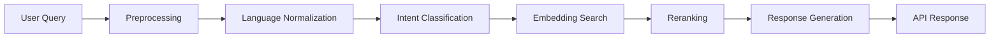

# NyaySaathi

NyaySaathi is a multilingual AI legal guidance platform that converts user legal problems into procedural next steps, required documents, escalation paths, and authority guidance.

## Project Overview

- Backend: Django REST API with modular AI pipeline and MongoDB-backed legal workflow retrieval.
- Frontend: React + Vite app deployed on Vercel.
- AI: Language detection, normalization, intent routing, semantic embeddings, reranking, and response generation.
- Deployment: Render for backend, Vercel for frontend.

## Repository Structure

```text
NyaySaathi/
|-- backend/
|   |-- manage.py
|   |-- requirements.txt
|   |-- requirements.lock.txt
|   |-- runtime.txt
|   |-- .env.example
|   |-- nyaysaathi_project/
|   |-- legal_cases/
|   |-- ai_engine/
|   |-- auth/
|   |-- api/
|   |-- middleware/
|   |-- models/
|   |-- services/
|   |-- utils/
|   |-- search/
|   `-- data/
|-- frontend/
|   |-- src/
|   |-- package.json
|   |-- vite.config.js
|   `-- .env.example
|-- dataset/
|-- docs/
|   |-- architecture.md
|   |-- api.md
|   `-- deployment.md
|-- scripts/
|   |-- import_dataset.py
|   `-- generate_embeddings.py
|-- render.yaml
`-- vercel.json
```

## Architecture Diagram



## Local Setup

### Backend

```bash
cd backend
python -m venv venv
venv\Scripts\activate
pip install -r requirements.txt
copy .env.example .env
python manage.py migrate
python manage.py runserver
```

### Frontend

```bash
cd frontend
npm install
copy .env.example .env
npm run dev
```

## Environment Variables

See `backend/.env.example` and `frontend/.env.example`.

Minimum required backend values:

- `MONGODB_URI`
- `MONGODB_DB`
- `DJANGO_SECRET_KEY`
- `DEBUG`
- `ALLOWED_HOSTS`
- `CORS_ALLOWED_ORIGINS`
- `OPENAI_API_KEY` (optional unless OpenAI-backed modules are enabled)

Frontend value:

- `VITE_API_URL`

## API Routes

- `GET /api/health` -> `{ "status": "ok" }`
- `GET /api/categories/`
- `GET /api/cases/`
- `GET|POST /api/search/`
- `POST /api/classify`
- `GET /api/case/<subcategory>/`
- `GET /api/health/ai/`
- `POST /api/auth/signup`
- `POST /api/auth/login`

## Deployment

### Render (Backend)

- Root directory: `backend`
- Build command:

```bash
pip install -r requirements.txt && python manage.py migrate && python manage.py collectstatic --noinput
```

- Start command:

```bash
gunicorn nyaysaathi_project.wsgi:application --bind 0.0.0.0:$PORT
```

### Vercel (Frontend)

- Uses root `vercel.json` with build output `frontend/dist`.
- Ensure `VITE_API_URL` points to the Render backend host.

## Operational Notes

- Structured logging and request middleware are enabled in Django settings.
- Throttling and rate-limit preparation are active for anonymous and classify paths.
- Mongo client uses retry/backoff and bounded pool settings for deployment resilience.

## Legal Disclaimer

NyaySaathi provides procedural guidance and does not replace formal legal advice.
