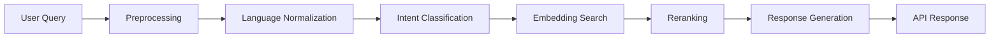

# NyaySaathi Architecture

## System Components

- Django REST API in backend for legal guidance endpoints.
- AI pipeline in backend/ai_engine for language normalization, intent detection, semantic retrieval, and response composition.
- MongoDB for legal workflows, users, and analytics.
- React + Vite frontend in frontend deployed to Vercel.
- Render-hosted backend using gunicorn.

## Repository Layout

- backend: Django app, AI engine, data access, search, services.
- frontend: Web application.
- dataset: Multilingual workflow source data.
- docs: Architecture, API, and deployment docs.
- scripts: Project-level operational utilities.

## Runtime Flow


```

## Data Flow

- Query arrives through /api/search or /api/classify.
- Input validation middleware and throttling apply.
- AI layer generates semantic match and workflow payload.
- Response is normalized into a stable API contract.
